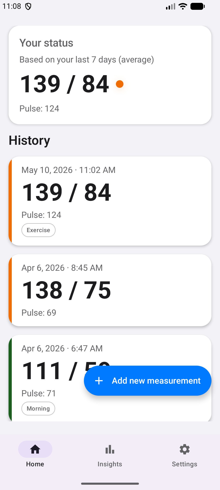
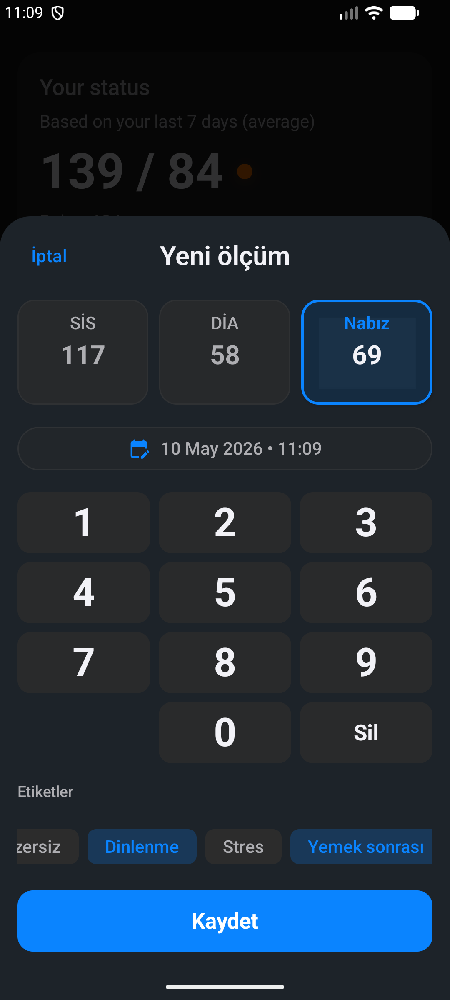
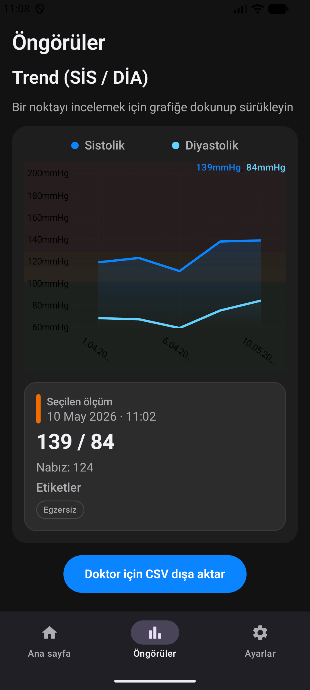
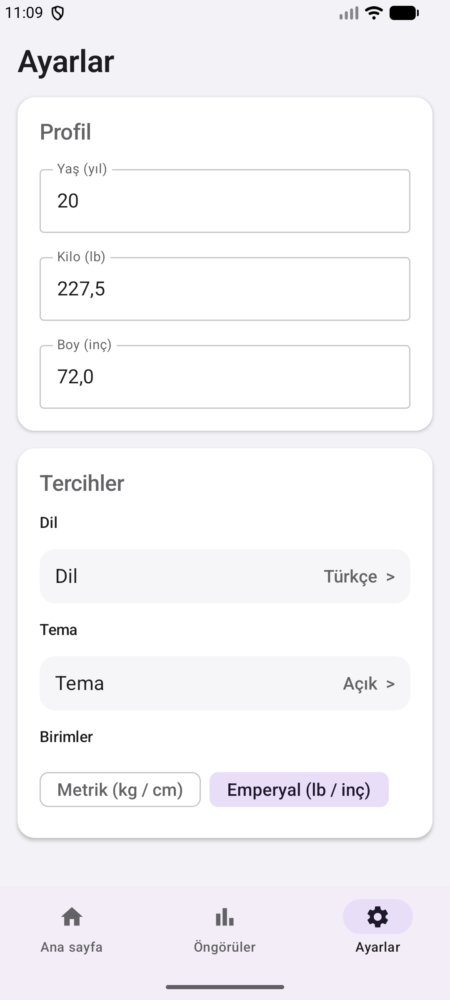

# 🩸 StayAlive - Premium Blood Pressure Monitor


**StayAlive** is a highly polished, 100% Native Android application for tracking blood pressure and pulse. Designed with a "Premium Medical" UI/UX approach, this app complies with WHO (World Health Organization) hypertension standards to provide intuitive, fast, and interactive health insights.

## ✨ Key Features

* **🩺 WHO Standard Indicators:** Automatically categorizes your readings (Normal, Elevated, Stage 1, Stage 2/Crisis) with visual color codings based on global health standards.
* **📱 Premium Medical UI:** A bespoke, high-contrast interface designed specifically for accessibility and ease of use. 
* **🧮 Smart Medical Calculator:** A custom-built, highly optimized numeric pad for lightning-fast and error-free data entry.
* **✏️ Full Data Manipulation:** Easily tap on any past record to enter "Edit Mode" where you can update values, change tags, or completely delete the measurement.
* **📊 Interactive Analytics:** Smooth, interactive trend charts built with Vico. Touch and scrub the chart to see historical data points instantly.
* **🌍 Full i18n & Dynamic Theming:** Complete support for Light/Dark modes and English/Turkish languages. Features zero hardcoded strings and dynamic database tags for seamless language switching.
* **💾 Offline-First (Room DB):** All data is stored securely on the local device using Android Room.
* **📤 Export for Doctors:** Easily export your entire measurement history as a `.csv` file via Android's native share sheet.

## 📸 Screenshots

Here is a glimpse of the app showcasing both Light/Dark themes and English/Turkish localization:

<p align="center">
  
  
  
  
  
  
  
</p>

## 🛠 Tech Stack & Architecture

This project strictly follows modern Android development best practices:

* **UI:** Jetpack Compose (Material Design 3)
* **Architecture:** MVVM (Model-View-ViewModel) + Repository Pattern
* **Concurrency:** Kotlin Coroutines & `StateFlow` for reactive, lifecycle-aware state management
* **Local Storage:** * Room Database (with custom `TypeConverters` for JSON tag storage)
  * Preferences DataStore (for managing user settings like theme and units)
* **Charts:** [Vico](https://patrykandpatrick.com/vico) for Compose-native interactive charts
* **Navigation:** Jetpack Compose Navigation

## 🚀 Getting Started

To build and run this project locally on your machine:

1. **Clone the repository:**
   ```bash
   git clone [https://github.com/semihtakilan/stayalive-blood-pressure.git](https://github.com/semihtakilan/stayalive-blood-pressure.git)
2. Open the project in **Android Studio** (Koala or newer is recommended).
3. Let Gradle sync and resolve all dependencies.
4. Build and run the app on an emulator or a physical device running **API 26 (Android 8.0)** or higher.

## 📂 Project Structure

* `data/`: Contains the Room Database setup, Entities (`Measurement`, `UserProfile`), DAOs, and the Repository layer.
* `ui/`: Contains all Jetpack Compose screens (`HomeScreen`, `InsightsScreen`, `AddMeasurementScreen`, `SettingsScreen`) and reusable UI components.
* `viewmodel/`: Contains the ViewModels that manage the UI state and handle business logic via StateFlow.
* `utils/`: Helper classes, including the WHO Category logic, Date/Time formatters, and CSV export functions.

## 🤝 Contributing

Contributions, issues, and feature requests are welcome! Feel free to check the [issues page](https://github.com/semihtakilan/stayalive-blood-pressure/issues) if you want to contribute.

## 👨‍💻 Author

**Semih TAKILAN**
Computer Engineering Student
[LinkedIn Profile](https://www.linkedin.com/in/semihtakilan) | [GitHub Profile](https://github.com/semihtakilan)
